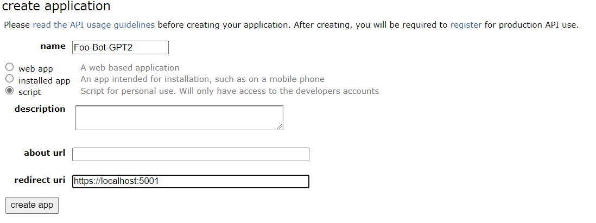

Thread Conversation Language Modeling Fine-Tuning and Generation On Individuals
===

Getting Started
---

This is a simple command line utility that can:

1. Obtain a users comment history based on the `collect-data` method
2. Create an appropriate training file based on the method `create-training`
3. Run the bot on a sub-reddit of your choosing with the method `run-bot`

Installation
---

### Prerequisites

- [Local PSQL installation](https://www.postgresql.org/download/windows/)
    - Or cloud based PSQL
- [Python 3.7 or above](https://www.python.org/downloads/)
- A working knowledge of python...

### Installation

The module can be directly installed through cloning the repository and installing via pip:

```bash
pip install  git+https://github.com/AJStangl/simple-bot-gpt2@master
``` 

However, it might be simpler for most to simply clone the repo:

```bash
git clone https://github.com/AJStangl/simple-bot-gpt2
cd simple-bot-gpt2
python setup.py build
pip install --editable .
```

And ensure that the proper dependencies are installed prior to build or installation.

Assuming the environment has been created installation should yield:

    Installing collected packages: simple-bot-gpt2
    Running setup.py develop for simple-bot-gpt2
    Successfully installed simple-bot-gpt2-0.0.1

Configuration
---

The configuration to run this is specified in two places and are required to be present.

1. A praw.ini file
2. A .env file

### praw.ini File

This is the standard ini file
for [praw ini](https://praw.readthedocs.io/en/stable/getting_started/configuration/prawini.html)
and is specific to the bot. There can be many configurations present here for multiple bots.

Example File:

```ini
[Foo-Bot-GPT2]
username = Foo-Bot-GPT2
password = Password123
bot_name = Foo-Bot-GPT2
bot_author = u/Author
bot_version = 1.0.0
client_id = some_client_id
client_secret = some_client_secret
user_agent = script:%(bot_name)s:v%(bot_version)s (by /u/%(bot_author)s)

[Bar-Bot-GPT2]
username = Bar-Bot-GPT2
password = Password123
bot_name = Bar-Bot-GPT2
bot_author = u/Author
bot_version = 1.0.0
client_id = some_client_id
client_secret = some_client_secret
user_agent = script:%(bot_name)s:v%(bot_version)s (by /u/%(bot_author)s)
```

The `client_id` and `client_secret` come from app registration in https://www.reddit.com/prefs/apps


Selecting the `create app` button will re-direct you to a new page where you can grab the client id and secret.

For the sake of simplicity the `username`, `bot_name`, and `[Bar-Bot-GPT2]` header section should all match. If they do
not, it's possible the bot may be mis-configured.

### The .env File

The env file contains some global configuration values used through the app. Primarily this is to hold the
username and password for your connection to a psql database, however, that is only important if you are collecting
data.

Everything in this file is required:

```env
PsqlUser="" // User name for psql instance
PsqlPassword="" // Password for psql instance
Foo-Bot-GPT2="D:\\models\\Foo-Bot" // Path to model for bot name Foo-Bot-GPT2
Bar-Bot-GPT2="D:\\models\\Bar-Bot" // Path to model for bot name Bar-Bot-GPT2
Baz-Bot="D:\\models\\Baz-Bot" // Path to model for bot name Baz-Bot
TriggerWords="I Should reply if I see this sentence,hi" // trigger words split on comma   
```

In the above we have 3 model paths. Each of these env names must **exactly** match the bot name found in the `praw.ini` sections.

In `praw.ini` we would expect the following sections:

```ini
[Foo-Bot-GPT2]
stuff

[Bar-Bot-GPT2]
stuff

[Baz-Bot]
stuff 
```

Both of these names must match the invocation of the run-bot. So in this example, if we wanted to run Foo-Bot-GPT2:

```bash
simple-bot-gpt2 run-bot --bot-name="Foo-Bot-GPT2" --sub-reddit="CoopAndPabloPlayHouse" --reply-rate="9000"
```

This will start the `Foo-Bot-GPT2` reddit account to reply to text on `CoopAndPabloPlayHouse` using the model
located in `D:\\models\\Foo-Bot`


Usage
---

The module can be used in two ways. As a command line utility of as package in src.

CLI Usage
___

```bash
simple-bot-gpt2 --help
```

```
Usage: simple-bot-gpt2 [OPTIONS] COMMAND [ARGS]...

Options:
  --help  Show this message and exit.

Commands:
  collect-data
  create-training
  run-bot
```

Each command can have the help flag further specified to see the full set of options for each command:

Example:

```bash
simple-bot-gpt2 run-bot --help
```

```
Usage: simple-bot-gpt2 run-bot [OPTIONS]

Options:
  --bot-name TEXT
  --sub-reddit TEXT
  --reply-rate TEXT
  --help             Show this message and exit.
```


Fine-Tuning Guide
---

Coming Soon